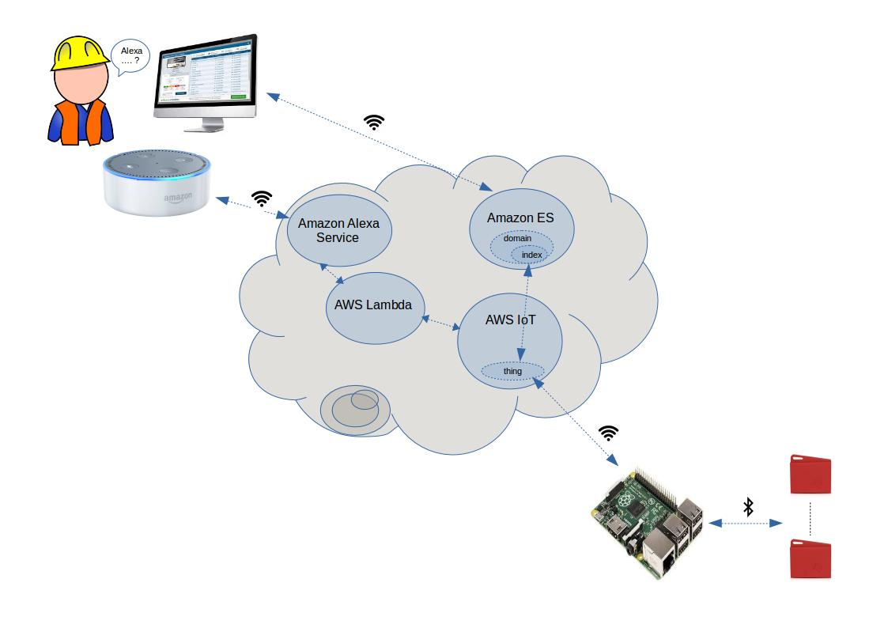
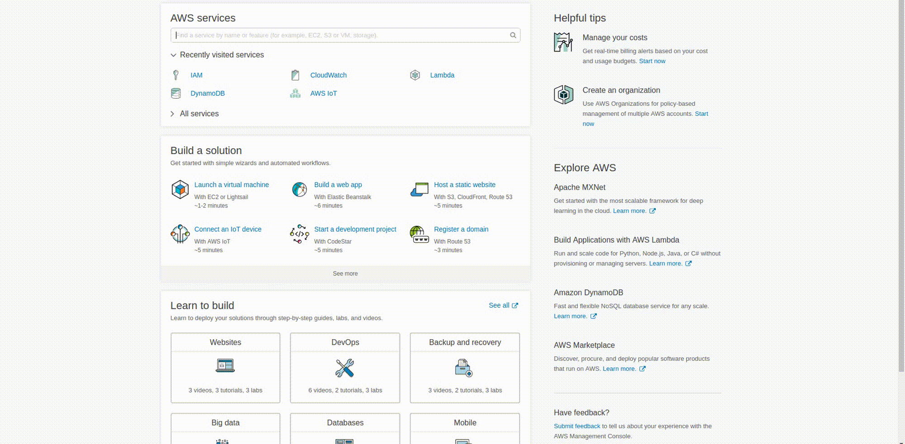
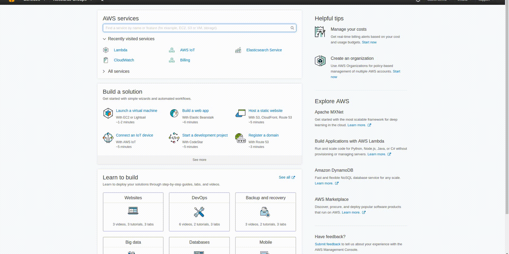

# Summary
  Alexa Skill to access and visualize on a web page data streamed from a TI SensorTag CC2650 to AWS IoT and Amazon Elasticsearch Service via a Raspberry PI 3 Model B gateway.
# Intro
  The motivation behind this project is to explore possible applications of Amazon Alexa in an industrial/factory environment as a possible worker friendly user interface, especially useful for workers that may not be computer literate.
  Through Alexa the worker would be able to ask for certain critical system parameters or error conditions, and to have some useful information displayed on a web connected monitor.
  The project presented here is a simple proof of concept with a much more limited scope.
  A TI SensorTag CC2650 is used to collect sensor data like temperature, barometric pressure, humidity.
  The SensorTag sends via bluetooth the data to a Raspberry PI, that acts as a gateway and forwards the data further to the AWS IoT servers. The data received by the servers updates the corresponding device shadow and is then pushed to Amazon Elasticsearch Service to be available for further processing and analytics, otherwise it would be lost as soon as a new update comes in.
  An Alexa Skill frontend can be used to retrieve the latest sensor values or to display a recent history for any given sensor. This data visualization capability is provided tanks to the Kibana plugin available in Elasticsearch service.
  The code developed here is based on examples provided in both the SensorTag Node.js library repository and the aws-iot-device-sdk-js repository. For more in depth information you can have a look there. Code and ideas have been also borrowed from some of the examples in the Alexa Cookbook repository, the web app used for the visualization is a minimally changed version of the one provided there.
  At the moment the data acquisition script that runs on the Raspberry PI samples the SensorTag around every 10 seconds, but this can be easily changed. 

  _The instructions below have been tested on a development workstation running Ubuntu 16.04 LTS._

# Setup
## TI SensorTag CC2650 SDK
No setup needed. Just make sure the battery is connected and press the power button (the smaller one) on the side to start searching for bluetooth connections.

## Amazon AWS Services
The management of the various Amazon AWS services used in this application can be done programmatically via the `AWS CLI`, but there are still certain operations that can only be done through the `AWS Web Console`. Instructions for most of the AWS services used are included here, except the ones referring to the Alexa Skill, that have been described separately.
Make sure before start you have both an Amazon Developer and AWS accounts.
The first step is to download and install the `AWS CLI`. To do it you can follow the instructions [here](http://docs.aws.amazon.com/cli/latest/userguide/tutorial-ec2-ubuntu.html). Please be aware that all the `AWS` resources and services utilized need to be located in the same `AWS region`, otherwise they won't be able to interact properly.

We can start by downloading the security credentials needed to access the `AWS` servers running the commands below. These commands can be saved as an executable bash script or as a bash `alias` for future use.
```shell
aws iot create-keys-and-certificate --set-as-active --certificate-pem-outfile cert.pem --public-key-outfile publicKey.pem --private-key-outfile privateKey.pem
```
We can then create the `thing` that will map the state of our `Raspberry PI` in the context of the  `AWS IoT` cloud:
```shell
aws iot create-thing --thing-name "raspberrypi-gateway" >> create_thing.out
```
The response printed by this command will includes the `ARN` that later will need to be included in the data acquisition script.
Later these files will need to be transferred to the `Raspberry PI`. 
The `AWS IoT Endpoint`, required in the data acquisition script configuration, can be determined running the command:
```shell
aws iot describe-endpoint >> aws_iot_endpoint.out
```
Any time the `Raspberry PI` sends a new update to `AWS IoT` the `thing shadow` document linked to the corresponding `thing` is updated with the new device state. Afterwards this update is forwarded also to a dedicated `Amazon Elasticsearch Service domain`, where it is stored for future reference. 
For this to happen we need to create first an `ES domain` and then to specify an `AWS IoT Rule` to feed the data from `AWS IoT` to `ES`.
I created the `Elasticsearch domain` through the web console first and named it `sensor-data`. At the same time there is the need to specify an access policy for the domain:
```json
{
  "Version": "2012-10-17",
  "Statement": [
    {
      "Effect": "Allow",
      "Principal": {
        "AWS": "<arn of the security role that allows aws iot to write into elasticsearch>"
      },
      "Action": "es:ESHttpPut",
      "Resource": "<your elasticsearch domain arn>/*"
    },
    {
      "Effect": "Allow",
      "Principal": {
        "AWS": "*"
      },
      "Action": "es:*",
      "Resource": "<your elasticsearch domain arn>/*",
      "Condition": {
        "IpAddress": {
          "aws:SourceIp": "<public ip address of the machine that needs to have access to the data>"
        }
      }
    }
  ]
}
```
I had also to create a security `role`, called `iot-es-action-role`, through the `AWS IAM console` to give `AWS IoT` the rights to connect to `ES` using the rule defined below:
```shell
aws iot create-topic-rule --region eu-west-1 --rule-name sensordataToElasticSearch --topic-rule-payload file://aws-iot-rule-to-route-sensor-data-to-elasticsearch-index.json
```
where the `JSON` configuration file is:
```json
{
"sql": "SELECT current.state AS state, cast(timestamp as number) * 1000 AS timestampMillis FROM '$aws/things/raspberrypi-gateway/shadow/update/documents'",

"actions": [

{

"elasticsearch": {

"roleArn": "<arn of your iot to es execution role>",

"endpoint": "<your es endpoint>",

"index": "<index name, sensortags in my case>",

"type": "raspberrypi-gateway",

"id": "${newuuid()}"

}

}

],

"ruleDisabled": false,

"awsIotSqlVersion": "2016-03-23-beta"

} 
```
The `ARN` in the file above is the one of the `IAM role` and can be retrieved from the `IAM console`. The `endpoint` is the same one used above.
The next thing to do is to define the structure of the `index` that will be used to organize data inside the `ES domain` created above. This is done again through the shell:
```shell
curl -XPUT <your es endpoint>/<domain> -d '{
"mappings": {
    "raspberrypi-gateway": {
      "properties": {
        "state": {
          "properties": {
            "desired": {
              "properties": {
                "timestamp": {
                  "type": "date",
                  "format": "epoch_millis"
                },
                "objectTemperature": {
                  "type": "float"
                },
                "ambientTemperature": {
                  "type": "float"
                },
                "accelerometerX": {
                  "type": "float"
                },
                "accelerometerY": {
                  "type": "float"
                },
                "accelerometerZ": {
                  "type": "float"
                },
                "humidity": {
                  "type": "float"
                },
                "magnetometerX": {
                  "type": "float"
                },
                "magnetometerY": {
                  "type": "float"
                },
                "magnetometerZ": {
                  "type": "float"
                },
                "barometricPressure": {
                  "type": "float"
                },
                "gyroscopeX": {
                  "type": "float"
                },
                "gyroscopeY": {
                  "type": "float"
                },
                "gyroscopeZ": {
                  "type": "float"
                },
                "luxometer": {
                  "type": "float"
                }
              }
            }
          }
        }
      }
    }
  }
}'
```
At this point all the infrastructure required to receive and process the sensor data should be in place.
We can now focus on developing the front-end of the application with the custom Alexa Skill, as described in the next section.

## Alexa Skill
Building an `Alexa Skill` requires two major steps:
* The specification of the VUI (voice user interface), done through the `amazon developer portal`, where a `voice interaction model` for the skill is described (with the recent introduction of the Alexa Skill SDK will be possible in the future to perform this step programmatically).
* The development of a Lambda function that will take care of all the skill's heavy lifting. The `AWS CLI` provides a programmatic interface for the development and upload of lambda functions.

The bridge between the `voice interaction model` and its `Lambda function`is represented by the `Alexa Voice Service (AVS)`.
The `voice interaction model (VIM)` can be viewed in fact as a sort of configuration file for the `AVS`. Thanks to a `VIM` the `AVS` knows for what words and sequences of words to look for whenever an `Amazon Echo` or other enabled devices sends to the `AVS` the actual audio stream recorded for the conversation. The `AVS` receives this audio stream and based on the specification encoded in the `VIM` decides what functions (`handlers`) to activate among those exported by the corresponding `Lambda function`. The `Lambda function` can then call other `AWS services` or services hosted elsewhere as needed.
I will start first creating a new `skill` through the `Amazon Developer Portal` as shown below:


### Voice Interaction Model
In the case of our `sensortag skill`, the voice interaction model is defined by an `intent schema`,
```json
{
  "intents": [
    {
      "intent": "SimpleQueryIntent",
      "slots":[
        {
          "name":"metric",
          "type":"SENSOR_METRIC"
      }
      ]
    },
    {
      "intent": "HistoricalQueryIntent",
      "slots":[
        {
          "name":"metric",
          "type":"SENSOR_METRIC"
      }
      ]
    },
    {
      "intent": "AMAZON.HelpIntent"
    },
    {
      "intent": "AMAZON.StopIntent"
    },
    {
      "intent": "AMAZON.CancelIntent"
    }
  ]
}
```
a description of the `sample utterances` that the skill should be able to recognize and associate to a specific `handler`
```txt
SimpleQueryIntent what's the {metric} now
SimpleQueryIntent tell me what's the {metric} now
SimpleQueryIntent the {metric} please
SimpleQueryIntent the latest {metric} please
SimpleQueryIntent the latest {metric} thankyou
SimpleQueryIntent {metric}
HistoricalQueryIntent show me the {metric} history
HistoricalQueryIntent show me the {metric} histogram
HistoricalQueryIntent show me a {metric} histogram
HistoricalQueryIntent give me the recent {metric} values
HistoricalQueryIntent the {metric} history please
HistoricalQueryIntent the {metric} history thankyou
HistoricalQueryIntent {metric} history
AMAZON.StopIntent ok thankyou
AMAZON.StopIntent ok
AMAZON.StopIntent thankyou
```
and a definition of the values allowed for the custom `slot` defined in the voice interaction
```txt
SENSOR_METRIC

temperature
acceleration
humidity
magnetic field
pressure
gyroscope
luminosity
```
This information can be specified through the `Amazon Developer portal`, in the `Alexa` section.

### Lambda Function
The lambda function leverages the `AWS Lambda` service and is written in `Node.js` (other languages can be used as well) and can be created directly through the `AWS Lambda Console` or through the `CLI`. I chose the latter:
```shell
aws lambda create-function \
--region eu-west-1 \
--function-name <lambda function name> \
--zip-file fileb://skill/src/index.zip \
--role <arn of your basic lambda execution role> \
--handler index.handler \
--runtime nodejs6.10 \
--profile default \
--timeout 10 \
--memory-size 1024
```
The `ARN` referred above is the one for the `execution role`, the default one, associated with the function that can be retrieved on the `AWS IAM console` and the `zip` file is the archive that contains the `node.js` script for the function, together with all the libraries it refers to.
If you're using `AWS Lambda` for the first time you will need to create a basic execution role, as explained in the picture below, and then copy its `ARN` in the file above, otherwise you can use a pre-existing role. 



The `index.js` file can be found under `alexa-amazon-iot/skill/src` in the project tree, together with the `package.json` file that lists its dependencies. The archive for the upload can be built going into the `alexa-amazon-iot/skill/src` folder and running:
```shell
npm install
```
This will install the `node.js` libraries under the `/node_modules/` directory.
After that, still from the same `alexa-amazon-iot/skill/src` folder, you can run the following command:
```shell
zip -X -r index.zip *
```
For future updates the lambda function can be modified running:
```shell
aws lambda update-function-code \
--region eu-west-1 \
--function-name <lambda function name> \
--zip-file fileb://index.zip \
```
Save the `ARN` for the function returned by the command above. We will used as as one of the skill configuration options.
If you create the lambda function through the command line as suggested above you still need to manually select what type of `triggers` can activate it (in our case the Alexa Skill). In theory this is something that should be doable from the `CLI`, but in practice the corresponding command refused to work for me. I had to login into the `AWS Lambda Console`, select the newly created lambda function and manually select the type of trigger that I wanted, as described in the picture below.



## Web App
Once the data is available in the `Amazon Elasticsearch service` it can be visualized using the embedded `Kibana` plugin. The visualizations can be fully customized, and once they are saved they have an IP address that can be used to retrieve them. This IP addresses need then to ber copied into the `/alexa-amazon-iot/webapp-thing/js/updateDom.js` file. The picture below shows one possible way to organize some of the sensor's data into a visualization that can be displayed by the web-app. 


The public IP address of the machine where the browser is running must be specifically enabled in the access policy document of your `Elasticsearch domain` for the application to work. The web app requires also the creation of a `AWS Cognito Pool`, whose ID needs to be specified in the `/alexa-amazon-iot/webapp-thing/js/aws_config.js` file. Follow the instructions in `/alexa-amazon-iot/webapp-thing/README.md` to do that.

## Raspberry PI 3 Model B
Install the latest `Raspbian` and log into the system directly or via SSH. Do a system upgrade, check for the version of Node.js included and install `npm`, the node package manager. 
```shell
pi@raspberrypi:~ $ sudo apt-get update
pi@raspberrypi:~ $ sudo apt-get upgrade
pi@raspberrypi:~ $ node -v
pi@raspberrypi:~ $ sudo apt-get install npm
```
Install also the bluetooth libraries and the SensorTag dependencies.
```shell
pi@raspberrypi:~ $ sudo npm install -g node-gyp
pi@raspberrypi:~ $ sudo apt-get install bluetooth bluez libbluetooth-dev libudev-dev
pi@raspberrypi:~ $ npm install noble
pi@raspberrypi:~ $ npm install sensortag
```
Copy the `package.json` and `data-acquisition-and-forwarding-to-aws-iot.js` files to the PI and run
```shell
pi@raspberrypi:~ $ npm install
```
to install the dependencies required by the script and listed in `package.json`.
Run the script:
```shell
pi@raspberrypi:~ $ sudo node data-acquisition-and-forwarding-to-aws-iot.js
```
Always run the script as `sudo`, otherwise there may be problems accessing some of the library modules.
The section of the script where the object that represents the `AWS IoT API` is initialized needs to be customized with your personal security credentials, plus the `ARN` for the thing shadow mapped to the physical device.
```js
var thingShadows = awsIot.thingShadow({
    keyPath: "../security/privateKey.pem",
    certPath: "../security/cert.pem",
      caPath: "../security/rootca.pem",
    clientId: "raspberrypi-gateway",
        host: "XXXXXXXXXXXXX.iot.eu-west-1.amazonaws.com"
  });
```

# Run the Demo
1. Power-on the `SensorTag` pushing the smaller of the two buttons on the sides of the device. A green LED light should start blinking, meaning the the device is ready to accept connections.
2. Login to the Raspberry PI and launch the data acquisition script. From the diagnostic messages printed on the console you should be able to tell if the operation has been successful or not. In case it was data will be transmitted to the `AWS IoT` cloud and backed up into `Amazon Elasticsearch service`.
3. If you followed the steps above in setting up the `AWS services` and the `Alexa Skill` your skill should be live and ready to execute your requests.
4. Have a look to the `SampleUtterances.txt` for suggestions about the requests currently supported
5. Open the `/alexa-amazon-iot/webapp-thing/thing1.html` file on your browser to see the information displayed whenever you ask Alexa for historical data. 


